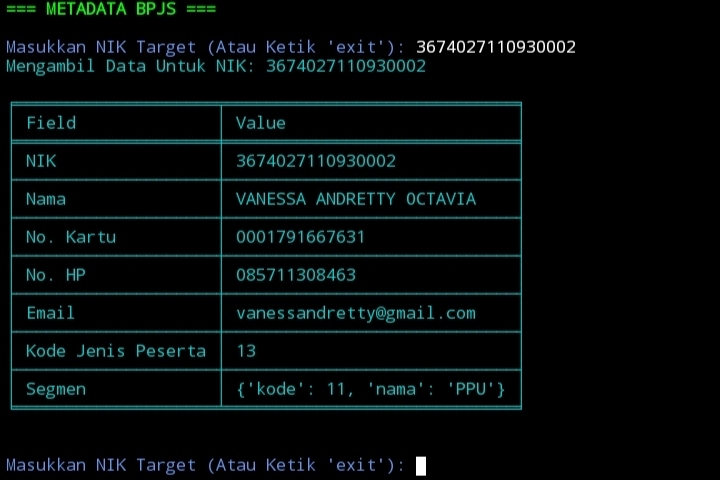
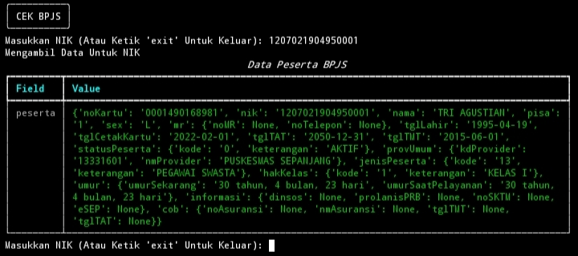
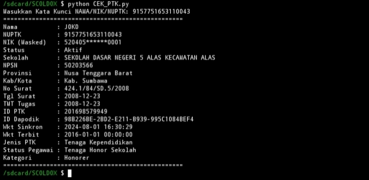
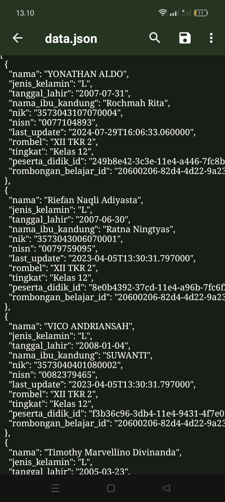

> **PERINGATAN KERAS !, Saya Adalah Development Resmi SCHOOLDOX, Saya Selalu Mengawasi Setiap User Yang Membeli Open Source Program Script SCHOOLDOX, Jika Ketahuan Ada User Yang Mencoba Menjual Source Code Maka Akses Source Tersebut Akan Saya Nonaktifkan Permanent Tanpa Toleransi Sedikitpun !**

> **YANG DI IZINKAN !, User Yang Membeli Open Source SCHOOLDOX Hanya Boleh Menggunakannya Untuk Kebutuhan Layanan Jasa Dan Lain Sebagainya, Sedangkan Untuk Pembelian Open Source Hanya Pada Development Resmi !**

**SCHOOLDOXV2** Adalah Program Script Profesional Untuk Mengambil, Mencari & Memvalidasi Data Siswa Sekolah Di Indonesia, Dirancang Untuk Analis Data Pendidikan Yang Lengkap Akurat & Terupdate 

---
## SCHOOLDOXV2 BOT
[Klik Untuk Akses Bot Di Telegram](https://t.me/absodhdhdidndodndocbot)

## Dump Database Siswa Lengkap Berdasarkan Npsn Sekolah & Menyediakan Informasi Lengkap Siswa Termasuk

  - Nama Lengkap
  - Jenis Kelamin
  - Tanggal Lahir
  - Nama Ibu Kandung
  - Nik/Nisn
  - Rombel/Tingkat
  - Peserta Didik Id
  - Validasi KPU & Revesery
  - Koordinat/Link Google Maps
    
## Validate Nik Ke Metadata Bpjs 

- Nik
- Nama Lengkap
- Nomor Kartu BPJS Peserta
- Nomor Hp
- Email
- Kode Jenis Peserta
- Segmen Peserta

## Validate Nik Ke Data Peserta BPJS

- Nomor Kartu BPJS Peserta 
- Nik
- Nama Lengkap
- Kode Pisa
- Jenis Kelamin
- Data Rekam Medis
- Tanggal Lahir
- Tanggal Centak Kartu
- Tanggal Akhir Berlalu Kartu
- Tanggal Mulai Berlaku Kartu
- Status Peserta
- Provider Layanan
- Jenis Peserta
- Hak Kelas
- Umur Peserta
- Dinsos
- Prolanisprb
- Nosktm
- Esep
- Data Peserta Cob
- Nomor Asuransi
- Nama Asuransi
- Tgltmt
- tgltat

 ## Validate Ke PTK

- Nama Lengkap
- Nuptk
- Nik
- Status 
- Sekolah
- Npsn
- Provinsi
- Kab/Kota
- No Surat
- Tgl Surat
- Tmt Tugas
- Id Ptk
- Id Dapodik
- Wkt Sinkron
- Wkt Terbit
- Jenis Ptk
- Status Pegawai
- Kategori
  
## Database Siswa Tersimpan Rapi Dalam Format Json & Csv

### Validasi Data Menggunakan Sumber Resmi Dukcapil/Dapodik/Kemendikbud
### Menyediakan Lokasi Siswa Lengkap Untuk Analisis Data
### Sistem Pencarian Interaktif Berdasarkan Nama Siswa 
### Output Mudah Digunakan & Dibagikan 

---

### Harga & Lisensi
Program Script Ini **PREMIUM** 
- **Harga:** **Rp1.000.000**
- Lisensi Berlaku Permanent & Open Source  
- Update & Perbaikan Bug Tersedia Gratis Setelah Pembelian  

 Untuk Pembelian & Lisensi Hubungi  
- **Telegram :** [@rolandino28](https://t.me/rolandino28)
- **Grup Telegram :** [t.me/Crackers Communitiy](https://t.me/Crackers_Communitiy)
- **Channel Testimoni :** [t.me/rolandinoanjay](https://t.me/rolandinoanjay)
  
---
### Peringatan

Program Ini Dibuat Hanya Untuk Riset Investigasi, Analis Data & Tujuan Edukasi, Segala Penyalahgunaan Di Luar Tujuan **BUKAN TANGGUNG JAWAB PENGEMBANG!**

---
