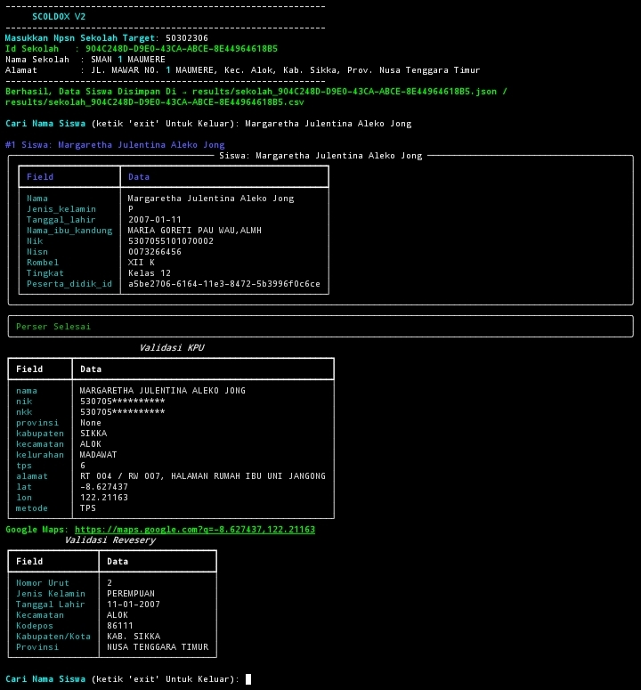
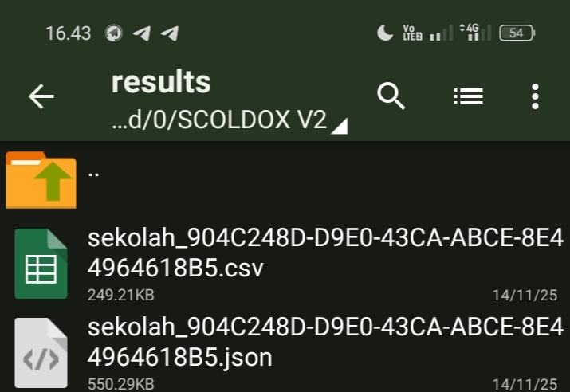
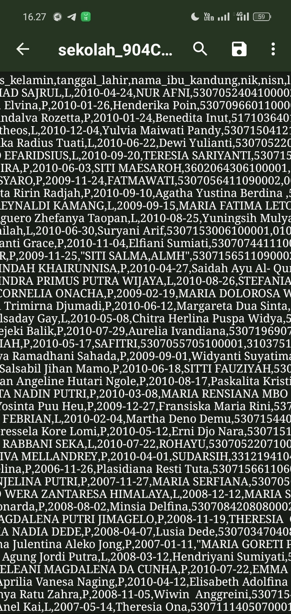
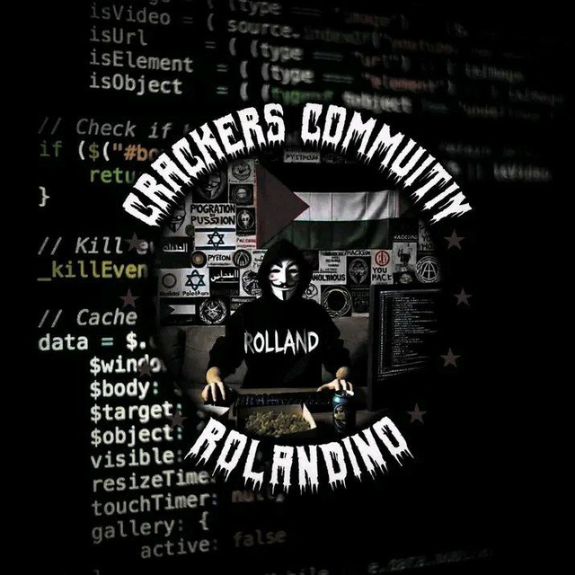

**SCHOOLDOXV2** adalah tools Python profesional untuk mengambil, mencari, dan memvalidasi **data siswa sekolah di Indonesia**. Dirancang untuk analis data pendidikan yang membutuhkan data lengkap dan akurat  

---

### Fitur Utama
## Ambil **data siswa lengkap** berdasarkan **NPSN Sekolah** & Menyediakan **informasi lengkap siswa**, termasuk

  - Nama lengkap
  - Jenis kelamin
  - Tanggal lahir
  - Nama ibu kandung
  - NIK / NISN
  - Rombel / Tingkat
  - Peserta_didik_id
  - Validasi KPU & Revesery
  - koordinat & link Google Maps
    
## Demo Video 

## Simpan hasil otomatis dalam JSON & CSV

---

### Keunggulan

- Data siswa **tersimpan rapi** dalam format JSON dan CSV
- Validasi data menggunakan **sumber resmi**
- Menyediakan **lokasi siswa lengkap** untuk analisis
- Sistem **pencarian interaktif** berdasarkan nama
- Output mudah dibagikan dan dianalisis

---

### Harga & Lisensi
Program Script Ini **Di Jual!** 
- **Harga:** **Rp500.000** ( Permanet & Open Source )
- Lisensi Berlaku Permanent & Open Source  
- Update & Perbaikan Bug Tersedia Gratis Setelah Pembelian  

 Untuk Pembelian & Lisensi Hubungi  
- **Telegram :** [@rolandino28](https://t.me/rolandino28)
- **Grup Telegram :** [t.me/Crackers_Teamm](https://t.me/Crackers_Teamm)
- **Channel Testimoni :** [t.me/rolandinoanjay](https://t.me/rolandinoanjay)
  
---
### Peringatan

Program Ini Dibuat Hanya Untuk Riset Investigasi, Analis Data & Tujuan Edukasi, Segala Penyalahgunaan Di Luar Tujuan **BUKAN TANGGUNG JAWAB PENGEMBANG!**

---
